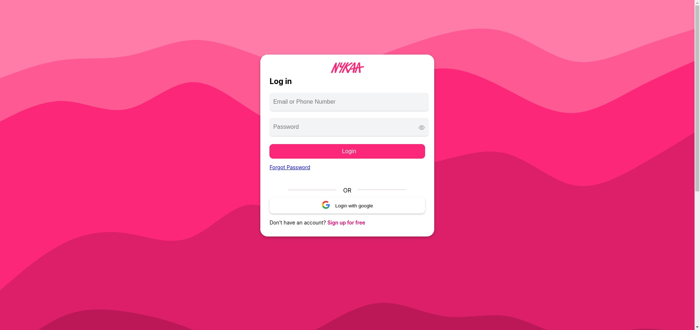
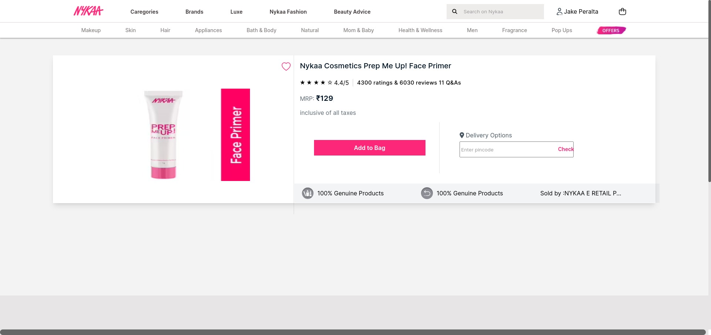
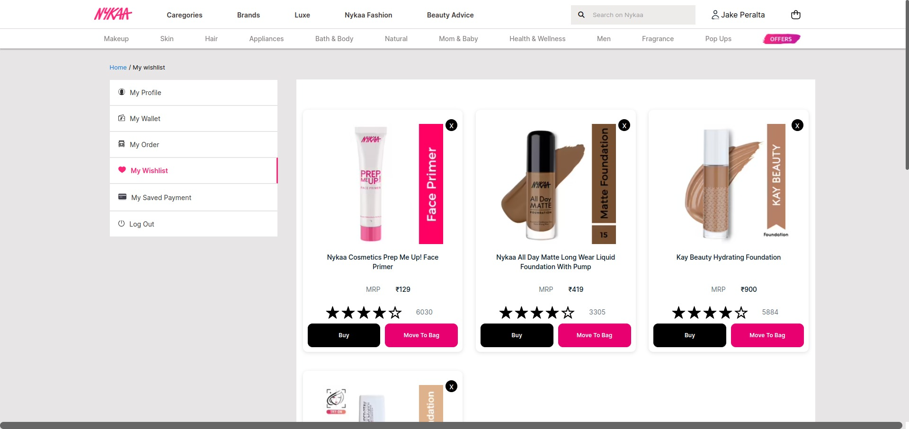
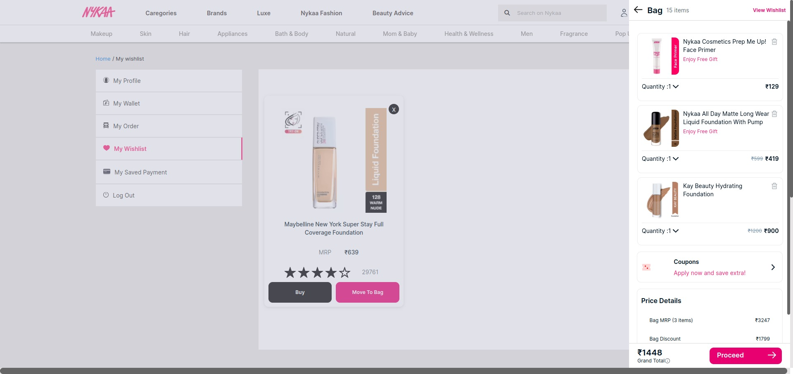
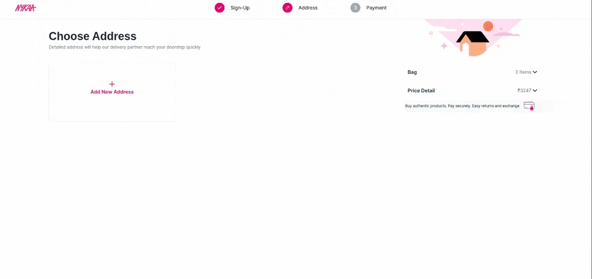
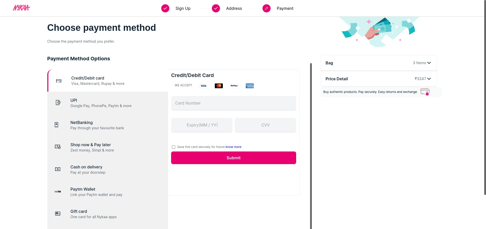
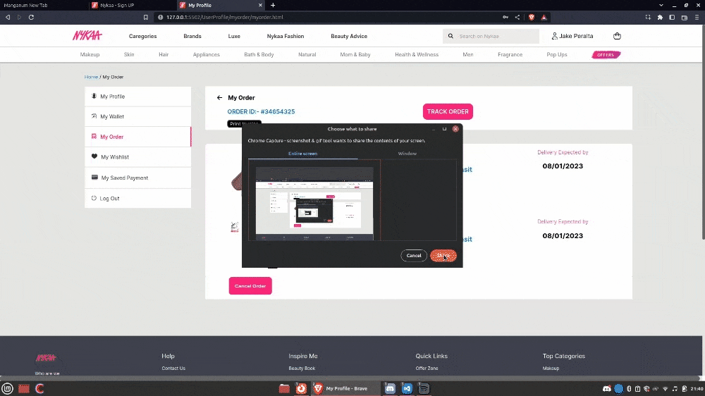

# **Nykaa-clone**
 ## **Project Description**

The goal of NYKAACLONE was to create a replica of Nykaa.com that functions similarly to the original website. This includes the ability to browse and purchase products, create an account, and view order history. The project was developed using only HTML, CSS, and JavaScript.

## **Tech stacks used :**
To create this clone following Tech stack is used by contributors.  
 

   

* **DOM**
* **Email JS**
* **FabIcons**
* **FontAwesome**

# **Project Status**

NYKAA-CLONE is now complete and fully functional. The team has successfully implemented all of the necessary features and functionality of the website.

## **About Nykaa**

Nykaa is an Indian e-commerce company, founded by Falguni Nayar in 2012 and headquartered in Mumbai. It sells beauty, wellness and fashion products across websites, mobile apps and 100+ offline stores. In 2020, it became the first Indian unicorn startup headed by a woman.

## Sneak Peak
#### **Landing Page:**

 

#### **Responsive Landing Page:**

 

#### Signup Page:

 

#### Login Page:

 

#### Getting otp by email Page:

 

#### Product Page:

 

#### Wishlist Function Page:

 

#### Cart Function Page:

 

####  Address Page:

 

#### Payment Page:

 

#### Bill invoice Page:

 

## Installation and Setup Instructions
Clone down this repository using this <a href="https://github.com/hero007noob/Nykaa-clone">link</a>  

## Team Members and Contributors

### Himanshu Sharma
- **Github** : hero007noob
- **Github Link** : https://github.com/hero007noob
- **Linkedin** : https://www.linkedin.com/in/himanshu-s-747a0b133/

### Anand R P
- **Github** : AnandRP2030
- **Github Link** : https://github.com/AnandRP2030
- **Linkedin** : https://www.linkedin.com/in/anandrp2030/

### Maharsh Dhasmana
- **Github** : maharshdhasmana
- **Github Link** :https://github.com/maharshdhasmana
- **Linkedin** : https://www.linkedin.com/in/maharsh-dhasmana-373166199/

### Pankaj Kumar Anand
- **Github** : Pkanand1999
- **Github Link** : https://github.com/Pkanand1999
- **Linkedin** : https://www.linkedin.com/in/pankaj-kumar-anand-5019a7250/

### Mohammad Gouse Syed
- **Github** : syed2605
- **Github Link** : https://github.com/syed2605
- **Linkedin** : https://www.linkedin.com/in/mohammad-gouse-syed-9751a5160/

### Rasika Gujar
- **Github** : rasikaG23
- **Github Link** : https://github.com/rasikaG23
- **Linkedin** :   https://www.linkedin.com/in/rasika-gujar-06a9841b3/

